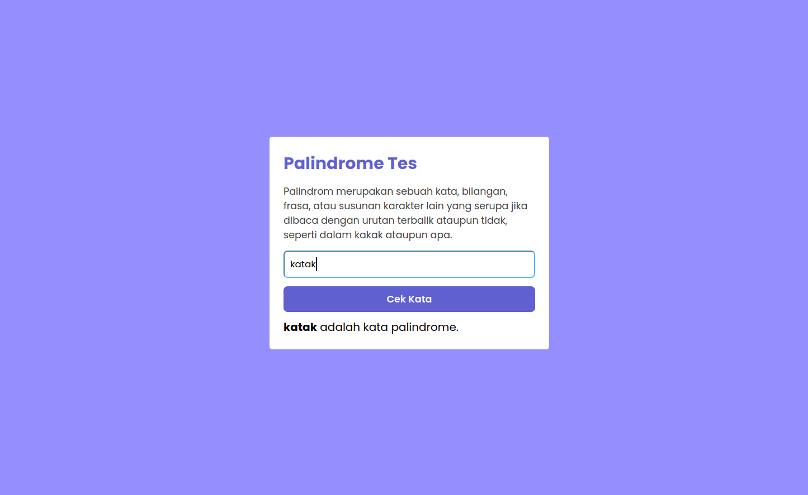
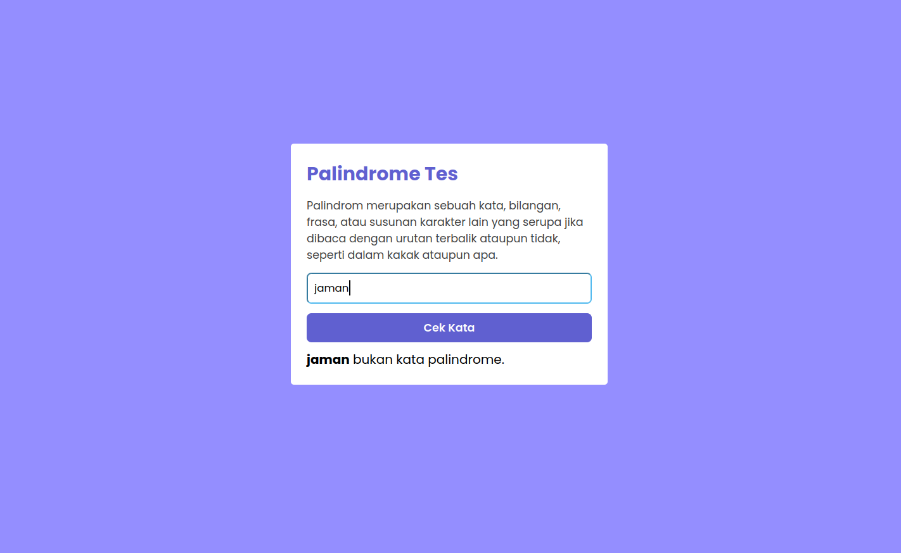

# Palindrome Checker

### A palindrome is a word, number, phrase, or other sequence of symbols that reads the same backwards as forwards, such as madam or racecar,

|                            |                                |
| :------------------------: | :----------------------------: |
|  |  |
